<!-- ═══════════════════════════════════════════════════════════════ -->
<!-- 🏯 GHOST OF TSUSHIMA INSPIRED GITHUB PROFILE                  -->
<!-- ═══════════════════════════════════════════════════════════════ -->

<p align="center">
  
</p>

<!-- ═══════════════ TYPING ANIMATION ═══════════════ -->

<p align="center">
  <a href="https://git.io/typing-svg">
    
  </a>
</p>

<br/>

<!-- ═══════════════ INK DIVIDER ═══════════════ -->
<p align="center"></p>

<!-- ═══════════════ THE TALE ═══════════════ -->

<h2 align="center">📜 The Tale of the Code Ronin</h2>

<p align="center">
  <em>"In the misty lands of Bengkulu, a warrior walks the path between data and design —<br/>
  crafting digital experiences with the precision of a blade and the beauty of falling cherry blossoms."</em>
</p>

<br/>

<table align="center">
<tr>
<td width="50%" valign="top">

### ⛩️ Who Am I

```text
🏯  3rd Year Informatics Engineering
    @ Universitas Bengkulu

⚔️  Junior Full-Stack Web Developer

📊  Data Analyst — Turning Chaos into Clarity

🌸  Google Student Ambassador (SA 25)

🏆  Bank Indonesia Scholarship Awardee

🗡️  Co-Founder of Rylox ID
```

</td>
<td width="50%" valign="top">

### 🗾 Current Quests

```text
📍  Active Quest:
    → Building interactive web experiences
    → Exploring data-driven solutions

🔮  Side Quest:
    → Mastering Go (Golang) backend
    → Contributing to open source

🌙  Daily Challenge:
    → Write clean, meaningful code
    → Learn something new every day
```

</td>
</tr>
</table>

<br/>

<!-- ═══════════════ INK DIVIDER ═══════════════ -->
<p align="center"></p>

<!-- ═══════════════ COMBAT STANCES (SKILLS) ═══════════════ -->

<h2 align="center">⚔️ Combat Stances — Technical Arts</h2>

<p align="center">
  <em>Each stance represents a mastered discipline in the art of code</em>
</p>

<br/>

<div align="center">

#### 🪨 Stone Stance — Core Languages
<p>
  
  
  
  
  
</p>

#### 🌊 Water Stance — Frameworks & Libraries
<p>
  
  
</p>

#### 💨 Wind Stance — Tools & Platforms
<p>
  
  
  
  
</p>

#### 🌙 Moon Stance — Data & Analytics
<p>
  
  
  
</p>

</div>

<br/>

<!-- ═══════════════ INK DIVIDER ═══════════════ -->
<p align="center"></p>

<!-- ═══════════════ LEGENDS UNLOCKED (ACHIEVEMENTS) ═══════════════ -->

<h2 align="center">🏆 Legends Unlocked — Achievements</h2>

<p align="center">
  <em>Honors earned along the ronin's journey</em>
</p>

<br/>

<div align="center">

| 🏅 Legend | 📜 Description | ⭐ Rarity |
|:---:|:---|:---:|
| 🌸 **Google Student Ambassador** | Selected as SA 25 representative at Universitas Bengkulu | ★★★★★ |
| 💰 **BI Scholarship Awardee** | Recipient of the prestigious Bank Indonesia Scholarship | ★★★★★ |
| ⚔️ **Co-Founder — Rylox ID** | Built and leads a thriving tech community | ★★★★☆ |
| 🏯 **Kinsure.id Member** | Active contributor to student-focused initiatives | ★★★☆☆ |
| 🎯 **Pop Survey Alumnus** | Participated in data-driven survey initiatives | ★★★☆☆ |
| 🗡️ **14 Repositories Forged** | Building a growing collection of code artifacts | ★★★☆☆ |

</div>

<br/>

<!-- ═══════════════ INK DIVIDER ═══════════════ -->
<p align="center"></p>

<!-- ═══════════════ BATTLE SCENE ═══════════════ -->

<h2 align="center">⚔️ The Duel — Live Combat</h2>

<p align="center">
  <em>Witness the ronin's blade in action against the demons of inefficiency</em>
</p>

<br/>

<p align="center">
  
</p>

<br/>

<!-- ═══════════════ INK DIVIDER ═══════════════ -->
<p align="center"></p>

<!-- ═══════════════ INTERACTIVE GAME ═══════════════ -->

<h2 align="center">🎮 Choose Your Stance, Warrior!</h2>

<p align="center">
  <em>Click a stance below to challenge the Oni. Each path reveals a different fate...</em>
</p>

<br/>

<div align="center">

<details>
<summary>🪨 <strong>Stone Stance</strong> — Unyielding Strength</summary>

<br/>

```
╔══════════════════════════════════════════════════╗
║  ⚔️  STONE STANCE ACTIVATED!                    ║
║                                                  ║
║  You plant your feet firmly, channeling the      ║
║  unbreakable force of the mountain.              ║
║                                                  ║
║  The Oni charges with Wind magic...              ║
║  But stone SHATTERS wind!                        ║
║                                                  ║
║  💥 CRITICAL HIT! → 50 DMG                      ║
║                                                  ║
║  ══════════════════════════════════════           ║
║  🏆 VICTORY! Your BACKEND skills level up!       ║
║  → PHP +10 XP | Go +10 XP                       ║
║  ══════════════════════════════════════           ║
╚══════════════════════════════════════════════════╝
```

> 🪨 *"Like stone, reliable backend code withstands any assault."*

</details>

<details>
<summary>🌊 <strong>Water Stance</strong> — Fluid Adaptation</summary>

<br/>

```
╔══════════════════════════════════════════════════╗
║  🌊  WATER STANCE ACTIVATED!                    ║
║                                                  ║
║  You flow like water, adapting to every attack.  ║
║  Your movements are elegant and precise.         ║
║                                                  ║
║  The Oni strikes with Stone fists...             ║
║  But water ERODES stone!                         ║
║                                                  ║
║  💥 PERFECT PARRY! → 45 DMG                     ║
║                                                  ║
║  ══════════════════════════════════════           ║
║  🏆 VICTORY! Your FRONTEND skills level up!      ║
║  → HTML +10 XP | CSS +10 XP | JS +10 XP         ║
║  ══════════════════════════════════════           ║
╚══════════════════════════════════════════════════╝
```

> 🌊 *"Like water, responsive design flows to fit any screen."*

</details>

<details>
<summary>💨 <strong>Wind Stance</strong> — Swift Precision</summary>

<br/>

```
╔══════════════════════════════════════════════════╗
║  💨  WIND STANCE ACTIVATED!                     ║
║                                                  ║
║  You move faster than the eye can follow.        ║
║  Your blade dances like leaves in a storm.       ║
║                                                  ║
║  The Oni casts Water magic...                    ║
║  But wind SCATTERS water!                        ║
║                                                  ║
║  💥 FLURRY STRIKE! → 55 DMG                     ║
║                                                  ║
║  ══════════════════════════════════════           ║
║  🏆 VICTORY! Your TOOLS mastery levels up!       ║
║  → Git +10 XP | GitHub +10 XP                   ║
║  ══════════════════════════════════════           ║
╚══════════════════════════════════════════════════╝
```

> 💨 *"Like wind, efficient tooling accelerates everything it touches."*

</details>

<details>
<summary>🌙 <strong>Moon Stance</strong> — Absolute Mastery</summary>

<br/>

```
╔══════════════════════════════════════════════════╗
║  🌙  MOON STANCE ACTIVATED!                     ║
║                                                  ║
║  The ultimate technique. You transcend all       ║
║  limitations, channeling the moonlight itself.   ║
║                                                  ║
║  The Oni trembles... it cannot comprehend        ║
║  the power of DATA-DRIVEN DECISIONS!             ║
║                                                  ║
║  💥 LEGENDARY STRIKE! → 99 DMG                  ║
║                                                  ║
║  ══════════════════════════════════════           ║
║  👑 PERFECT VICTORY! DATA mastery achieved!      ║
║  → Analysis +20 XP | Visualization +20 XP       ║
║  ══════════════════════════════════════           ║
║                                                  ║
║  🌸 "The Ghost sheathed his blade as cherry     ║
║     blossoms drifted across the moonlit field."  ║
╚══════════════════════════════════════════════════╝
```

> 🌙 *"Like the moon, data illuminates what was hidden in darkness."*

</details>

</div>

<br/>

<!-- ═══════════════ INK DIVIDER ═══════════════ -->
<p align="center"></p>

<!-- ═══════════════ BATTLE STATISTICS ═══════════════ -->

<h2 align="center">📊 Battle Statistics</h2>

<p align="center">
  <em>The warrior's record of combat across the digital battlefield</em>
</p>

<br/>

<div align="center">
  
  &nbsp;&nbsp;&nbsp;
  
</div>

<br/>

<p align="center">
  
</p>

<br/>

<!-- ═══════════════ INK DIVIDER ═══════════════ -->
<p align="center"></p>

<!-- ═══════════════ CONTRIBUTION SNAKE ═══════════════ -->

<h2 align="center">🐍 The Serpent's Path — Contributions</h2>

<p align="center">
  <em>Watch as the serpent devours the contribution fields</em>
</p>

<br/>

<p align="center">
  <picture>
    <source media="(prefers-color-scheme: dark)" srcset="https://raw.githubusercontent.com/YusufArrayyan/YusufArrayyan/output/github-snake-dark.svg"/>
    <source media="(prefers-color-scheme: light)" srcset="https://raw.githubusercontent.com/YusufArrayyan/YusufArrayyan/output/github-snake.svg"/>
    
  </picture>
</p>

<br/>

<!-- ═══════════════ INK DIVIDER ═══════════════ -->
<p align="center"></p>

<!-- ═══════════════ CONNECT — GAME MENU ═══════════════ -->

<h2 align="center">🗡️ Forge an Alliance</h2>

<p align="center">
  <em>Every great warrior needs allies. Let our paths cross.</em>
</p>

<br/>

<p align="center">
  <a href="https://www.linkedin.com/in/yusuf-arrayyan/">
    
  </a>
  &nbsp;
  <a href="https://www.instagram.com/yus.arrya/">
    
  </a>
  &nbsp;
  <a href="https://github.com/YusufArrayyan">
    
  </a>
  &nbsp;
  <a href="mailto:yusuf.arrayyan@gmail.com">
    
  </a>
</p>

<br/>

<!-- ═══════════════ PROFILE VIEWS ═══════════════ -->

<p align="center">
  
</p>

<br/>

<!-- ═══════════════ FOOTER ═══════════════ -->

<p align="center">
  
</p>

<p align="center">
  <sub>⛩️ <em>"Honor is not given. It is earned by the code you write and the lives you change."</em> ⛩️</sub>
</p>

<!-- ═══════════════════════════════════════════════════════════════ -->
<!-- 🌸 Crafted with honor by Yusuf Arrayyan — The Code Ronin 🌸  -->
<!-- ═══════════════════════════════════════════════════════════════ -->
